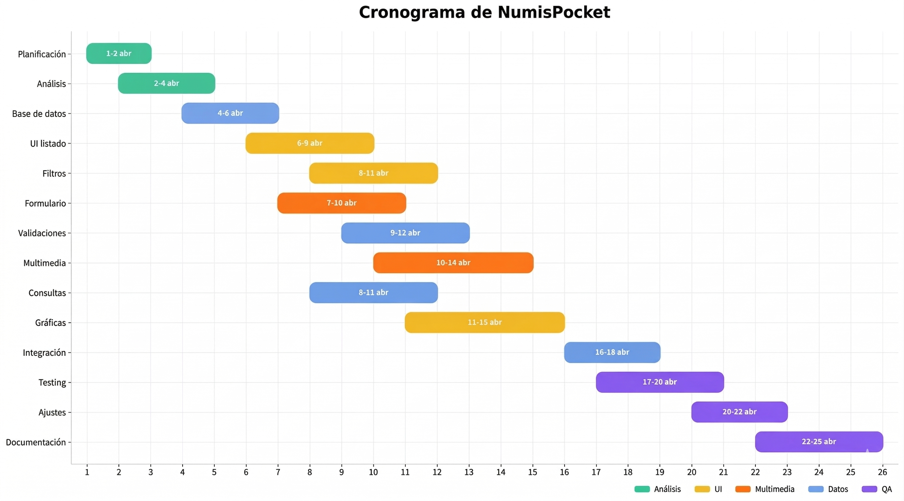

--- 
titlepage: true 
titlepage-logo: "images/cesar-Manrique.png" 
logo-width: 10cm 

title: "Módulo de Proyecto (PPP)"
subtitle: "Gestor de colecciones numismáticas " 
subsubtitle: "C.F.G.S. Desarrollo de Aplicaciones Multiplataforma (DAM)" 
author: [José Daniel Artiles González, Santiago Atienza Ferro, María Colina Lorda] 
keywords: [React, Expo, Drizzle, PPP, DAM ] 
date: '\today' 

lang: es 
toc: true 
toc-depth: 2

numbersections: true 

fontsize: 11pt
geometry: margin=2.5cm
highlight-style: tango
header-includes:
    - \usepackage{calc}
    - \newcounter{none}
---
\newpage

**Ciclo formativo	C.F.G.S. Desarrollo de Aplicaciones Multiplataforma (DAM)**

**Módulo:**	Proyecto (PPP)

**Centro:**	CIFP César Manrique

**Autoría:** José Daniel Artiles González, Santiago Atienza Ferro, María Colina Lorda
 
**Fecha prevista de entrega:** 	26 de abril de 2026

**Tutor:**	Juan Carlos Pérez Rodríguez

**Repositorio:** ppp_grupo1_25_26

# Introducción

El presente documento desarrolla el anteproyecto del sistema Gestor móvil de colecciones numismáticas, una aplicación pensada para registrar, organizar y consultar monedas y billetes desde un teléfono móvil. La propuesta parte de una idea sencilla pero muy útil: permitir que una persona coleccionista tenga su inventario siempre disponible, incluso sin conexión a internet, con una interfaz cómoda y un almacenamiento local fiable.

La aplicación se construirá con React Native, utilizando Drizzle ORM como capa de acceso a datos y SQLite como base de datos local. Esta combinación tecnológica encaja con los conocimientos del ciclo de DAM y, al mismo tiempo, permite obtener un resultado que se aproxima a un producto profesional real: una aplicación móvil multiplataforma, con persistencia, formularios, navegación, gestión de imágenes y estadísticas básicas.

Este anteproyecto tiene una función doble. Por una parte, sirve para dejar claro qué se va a desarrollar, cuál será el alcance real del proyecto y cómo se organizará el trabajo de las tres personas del grupo. Por otra, permite demostrar que la propuesta responde de forma coherente a los requisitos de evaluación del módulo, especialmente en lo relativo al mínimo de tres pantallas, al uso de persistencia local, al CRUD obligatorio, a la existencia de documentación técnica y al seguimiento del trabajo mediante GitHub.

El documento no busca convertirse en un manual técnico exhaustivo. Se centra en explicar, con lenguaje claro y ordenado, las decisiones esenciales del proyecto: por qué esta aplicación puede resultar útil, qué partes tendrá, qué tareas hay que completar, cómo se van a repartir y en qué plazos se espera terminar cada fase para que la entrega no supere en ningún caso el 26 de abril de 2026.

También se ha tenido en cuenta la recomendación del profesor de incorporar fotografías reales de monedas o billetes. Ese detalle hace que la propuesta resulte más atractiva y más cercana a un uso real, ya que permite documentar piezas con defectos de imprenta, errores de acuñación o rasgos especiales que son especialmente relevantes para una persona aficionada a la numismática.

# Origen, contextualización y justificación del proyecto

La idea del proyecto surge al observar un problema común en muchas aficiones de colección: el material se conserva físicamente con bastante cuidado, pero la información sobre cada pieza se gestiona de forma dispersa. Es habitual encontrar personas que anotan datos en hojas sueltas, en archivos de texto, en notas del móvil o en aplicaciones genéricas que no están preparadas para describir correctamente una moneda o un billete. Eso complica saber qué piezas se tienen, cuáles faltan, qué ejemplares presentan algún rasgo singular y qué información conviene consultar de un vistazo.

En el caso de la numismática, además, la imagen de la pieza tiene un valor documental importante. Una fotografía puede mostrar el desgaste, el estado de conservación, un error de acuñación, una diferencia en el reverso o un detalle que ayuda a distinguir una pieza común de otra especialmente interesante. Por este motivo, incorporar cámara o galería no se plantea como un adorno visual, sino como una funcionalidad directamente relacionada con la utilidad real de la aplicación.

Desde el punto de vista académico, el proyecto está bien contextualizado dentro del ciclo de DAM. Integra conocimientos de programación, desarrollo móvil, acceso a datos, modelado de información, trabajo en equipo, control de versiones, planificación y documentación. También obliga a tomar decisiones razonables de alcance, algo importante en un proyecto de fin de ciclo: no se trata de proponer todas las ideas posibles, sino de seleccionar aquellas que aportan valor y pueden entregarse en plazo con un resultado sólido.

La propuesta se justifica también por su viabilidad. La aplicación no depende de un servidor remoto ni de servicios complejos de terceros. Al funcionar en local con SQLite, es perfectamente usable sin conexión, reduce la complejidad técnica y facilita que el equipo se concentre en la parte realmente evaluable: persistencia, interfaz móvil, operaciones CRUD, integración de imágenes, estadísticas y documentación bien presentada.

Por tanto, el proyecto responde a una necesidad concreta, tiene interés práctico, es coherente con los contenidos del ciclo y puede defenderse con facilidad ante un público que no conozca previamente la aplicación. Esa combinación entre utilidad, viabilidad y claridad de exposición es una de las principales fortalezas de la propuesta.

# Objetivo general del proyecto

El objetivo general del proyecto es diseñar y desarrollar una aplicación móvil funcional que permita registrar, consultar, editar, eliminar y analizar una colección numismática mediante almacenamiento local en SQLite, de manera que el usuario pueda gestionar sus monedas y billetes desde el propio dispositivo sin depender de una conexión a internet.

De este objetivo principal se derivan varios objetivos específicos. El primero consiste en definir una base de datos local clara y bien organizada para almacenar información relevante de cada pieza: nombre, país, año, valor facial, tipo, material, estado de conservación, rareza, observaciones, imagen asociada y fechas de creación o actualización. El segundo objetivo es crear una interfaz intuitiva, con navegación sencilla y formularios fáciles de usar, para que la aplicación resulte accesible incluso a una persona con pocos conocimientos técnicos.

El tercer objetivo específico es implementar un CRUD completo. Esto implica que la persona usuaria podrá dar de alta nuevas piezas, consultarlas en un listado general, modificar sus datos y borrarlas cuando sea necesario. El cuarto objetivo es añadir soporte multimedia mediante cámara o galería, de modo que cada ficha pueda tener una fotografía real. El quinto objetivo es generar estadísticas útiles, con tarjetas resumen y gráficas simples, orientadas a mostrar el estado general de la colección sin sobrecargar el proyecto con cálculos innecesarios.

Por último, el proyecto tiene un objetivo documental y organizativo: demostrar una planificación coherente, repartir responsabilidades entre los tres integrantes del grupo, mantener un repositorio privado en GitHub con issues y commits alineados con las tareas, y presentar una memoria y una exposición final que reflejen con claridad lo que se ha construido.

# Descripción del proyecto

La aplicación recibirá provisionalmente el nombre de NumisPocket. Se plantea como un gestor móvil personal, orientado a colecciones privadas de monedas y billetes. Su primera versión se centrará en el inventario y consulta de piezas propias. Quedan expresamente fuera del alcance la compraventa, la sincronización en la nube, la autenticación con servidor, la tasación en tiempo real o la creación de un gran catálogo numismático mundial precargado. Esta decisión es intencionada y busca que el equipo llegue con seguridad a una entrega completa y defendible.

La estructura de la app girará alrededor de tres pantallas principales. La primera será el listado general de la colección. Actuará como pantalla de inicio y permitirá consultar todas las piezas almacenadas, buscar por texto y filtrar por campos relevantes, por ejemplo país, año, tipo de pieza, material, estado de conservación o disponibilidad de fotografía. Desde esta vista se podrá acceder a la ficha de cada registro y al formulario para añadir una pieza nueva.

La segunda pantalla será el módulo de alta y edición. Aquí se implementará el formulario principal del sistema. Este formulario permitirá introducir todos los datos básicos de una pieza numismática, validar la información antes de guardarla y cargar los datos ya existentes cuando se abra una ficha para editarla. Además, incluirá la integración con la cámara del dispositivo o con la galería para asociar una imagen real a cada moneda o billete.

La tercera pantalla será la de estadísticas. Su función será ofrecer una lectura global del estado de la colección sin obligar a revisar pieza por pieza. Mostrará el número total de registros, el porcentaje de piezas con fotografía, la distribución por países o tipos y algunas gráficas simples que ayuden a visualizar la colección. Esta parte está pensada para reforzar la puntuación del proyecto, pero se diseñará con criterios realistas para no poner en riesgo la funcionalidad obligatoria.

Desde el punto de vista técnico, React Native se utilizará para construir la interfaz móvil, aprovechando una tecnología moderna y muy conectada con los conocimientos web adquiridos en el ciclo. Expo facilitará la puesta en marcha del proyecto, la instalación de librerías y la prueba en dispositivos reales. SQLite se encargará del almacenamiento local y Drizzle ORM ayudará a definir el esquema de datos y a organizar las consultas, inserciones, actualizaciones y borrados de forma más limpia.

La arquitectura prevista será sencilla por capas. La separación en capas permite desacoplar la lógica de negocio de la interfaz, facilitando futuras ampliaciones y reduciendo la complejidad del mantenimiento. En la capa de presentación estarán las pantallas, componentes, botones, tarjetas y formularios. En la capa de lógica se aplicarán validaciones y reglas de negocio elementales, como impedir que se guarde una pieza sin nombre identificativo o comprobar que el año tenga formato válido. En la capa de datos se situarán el esquema de Drizzle, las funciones CRUD y las consultas necesarias para el listado y las estadísticas. Esta organización no busca complejidad extra, sino claridad y mantenimiento.

También se cuidará el aspecto visual de la aplicación. Aunque el proyecto sea académico, se pretende que el diseño sea agradable y moderno: tarjetas limpias, colores consistentes, formularios ordenados, gráficos legibles y capturas que permitan mostrar un producto convincente durante la exposición. La interfaz se diseñará para que resulte atractiva, pero sin caer en soluciones demasiado complejas que consuman tiempo de desarrollo innecesario.

## Tecnologías previstas

| Elemento             | Tecnología                       | Justificación                                                                                |
| -------------------- | -------------------------------- | -------------------------------------------------------------------------------------------- |
| Framework móvil      | React Native con Expo            | Permite crear una app móvil moderna, probarla con rapidez y reutilizar conocimientos web.    |
| Persistencia local   | SQLite                           | Base de datos ligera integrada en el dispositivo, ideal para un inventario personal offline. |
| ORM                  | Drizzle ORM                      | Facilita el modelado del esquema y mantiene ordenada la capa de acceso a datos.              |
| Navegación           | React Navigation / Expo Router   | Organiza de forma clara las tres pantallas y el paso de parámetros.                          |
| Multimedia           | Expo Camera / Expo Image Picker  | Permite tomar fotografías reales o seleccionar imágenes desde la galería.                    |
| Gráficas             | react-native-chart-kit o similar | Cubre la pantalla de estadísticas con un coste razonable de implementación.                  |
| Control de versiones | GitHub privado                   | Permite seguimiento mediante issues, ramas y commits relacionados con cada tarea.            |

## Modelo de datos previsto

La tabla principal será la de piezas numismáticas. Cada registro tendrá, como mínimo, los campos id, nombre, tipo de pieza, país, año, valor facial, material, estado de conservación, rareza, observaciones, ruta de imagen, fecha de alta y fecha de actualización. Este modelo cubre con solvencia las necesidades de una primera versión y deja margen para ampliaciones futuras.

No se pretende sobredimensionar la base de datos. La normalización se aplicará de forma razonable: algunos valores podrán gestionarse inicialmente mediante listas controladas en la interfaz si eso simplifica el proyecto. Solo se separarán en tablas adicionales aquellos elementos que de verdad aporten claridad o reutilización. Si el tiempo lo permite, se valorará incluir una pequeña tabla de perfil para cubrir una futura pantalla 'about me' con avatar, aunque esa parte no se considera prioritaria frente al CRUD y las estadísticas.

El modelo se ha diseñado buscando un equilibrio entre normalización y simplicidad, evitando complejidad innecesaria en un contexto de aplicación móvil local.

# Tareas

A continuación, se describen las tareas principales del proyecto. Se ha fijado una planificación realista y cerrada antes del 26 de abril de 2026. Además, se ha repartido el trabajo teniendo en cuenta que, preferiblemente, cada integrante del grupo se responsabilice de una pantalla principal.

## Tarea 1. Planificación inicial y preparación del entorno

Esta tarea abarca la creación del repositorio privado en GitHub, la configuración inicial del proyecto con Expo, la instalación de Node.js y las dependencias básicas, la definición de la estructura de carpetas y la apertura de las primeras issues. También incluye el acuerdo del equipo sobre normas de commits, ramas y reparto inicial de responsabilidades. La metodología será colaborativa y servirá para dejar una base estable sobre la que desarrollar el resto del proyecto sin pérdidas de tiempo posteriores.

|                        |                                                                       |
| ---------------------- | --------------------------------------------------------------------- |
| Duración               | 12 horas                                                              |
| Fecha y hora de inicio | 01/04/2026 16:00                                                      |
| Fecha y hora de fin    | 02/04/2026 20:00                                                      |
| Recursos humanos       | 3 integrantes                                                         |
| Recursos materiales    | Ordenadores, internet, VS Code, GitHub, Expo CLI                      |
| Coste estimado         | 480 € directos                                                        |
| Responsable            | Responsabilidad compartida; coordinación por Integrante 1             |
| Metodología            | Desarrollo incremental, validación continua y revisión por el equipo. |

### Subtareas

- Creación del repositorio
- Configuración de Expo
- Instalación de dependencias
- Estructura de carpetas
- Definición de issues
- Normas de commits

## Tarea 2. Análisis funcional y diseño técnico

En esta fase se concretarán los requisitos funcionales y no funcionales, los casos de uso, el modelo de datos, la navegación entre pantallas y los criterios de validación del formulario. También se decidirán el estilo visual base, los colores, la organización del menú y los datos mínimos que debe mostrar cada vista. El resultado será un diseño suficientemente claro para comenzar a programar sin incertidumbres.

|                        |                                                                        |
| ---------------------- | ---------------------------------------------------------------------- |
| Duración               | 14 horas                                                               |
| Fecha y hora de inicio | 03/04/2026 16:00                                                       |
| Fecha y hora de fin    | 04/04/2026 20:00                                                       |
| Recursos humanos       | 3 integrantes                                                          |
| Recursos materiales    | Herramientas de diagramación, procesador de textos, tablero compartido |
| Coste estimado         | 560 € directos                                                         |
| Responsable            | Integrante 1                                                           |
| Metodología            | Desarrollo incremental, validación continua y revisión por el equipo.  |

### Subtareas

- Definición de requisitos
- Diseño de navegación
- Modelo de datos
- Validaciones
- Diseño visual base

## Tarea 3. Diseño e implementación de la base de datos local

Se creará el esquema SQLite con Drizzle ORM y se programarán las funciones CRUD básicas, junto con consultas de filtrado y agregación para las estadísticas. Esta fase es crítica porque el resto de pantallas dependerá de disponer de una capa de datos estable. La metodología será incremental: primero se define el esquema, después se validan inserciones y consultas, y por último se prueban actualizaciones y borrados.

|                        |                                                                       |
| ---------------------- | --------------------------------------------------------------------- |
| Duración               | 16 horas                                                              |
| Fecha y hora de inicio | 05/04/2026 16:00                                                      |
| Fecha y hora de fin    | 06/04/2026 20:00                                                      |
| Recursos humanos       | 2 integrantes con apoyo del tercero                                   |
| Recursos materiales    | SQLite, Drizzle ORM, entorno de pruebas                               |
| Coste estimado         | 640 € directos                                                        |
| Responsable            | Integrante 2                                                          |
| Metodología            | Desarrollo incremental, validación continua y revisión por el equipo. |

### Subtareas

- Diseño del esquema
- Creación de tablas
- CRUD básico
- Consultas
- Validación de datos

## Tarea 4. Desarrollo de la pantalla de listado y filtrado

Se implementará la pantalla principal de la app: tarjetas o lista de piezas, cuadro de búsqueda, filtros rápidos y acceso a la edición de cada registro. Se cuidará especialmente la usabilidad, ya que esta pantalla será la más utilizada durante la demostración. Se trabajará con datos de prueba desde el principio para detectar problemas visuales o de rendimiento con suficiente antelación.

|                        |                                                                       |
| ---------------------- | --------------------------------------------------------------------- |
| Duración               | 18 horas                                                              |
| Fecha y hora de inicio | 07/04/2026 16:00                                                      |
| Fecha y hora de fin    | 11/04/2026 20:00                                                      |
| Recursos humanos       | 1 integrante principal + apoyo en revisión                            |
| Recursos materiales    | React Native, componentes visuales, emulador o móvil                  |
| Coste estimado         | 720 € directos                                                        |
| Responsable            | Integrante 1                                                          |
| Metodología            | Desarrollo incremental, validación continua y revisión por el equipo. |

### Subtareas

- Diseño de interfaz
- Lista de elementos
- Búsqueda
- Filtros
- Navegación
- Pruebas funcionales

## Tarea 5. Desarrollo del módulo de alta y edición con fotografía

Esta tarea cubre el formulario de alta, la edición de registros, la validación de campos, la confirmación de borrado y la integración con la cámara o galería. Se considera una de las piezas clave del proyecto porque concentra el CRUD obligatorio y la parte multimedia que aporta interés visual. El objetivo es que una nueva pieza pueda registrarse en pocos pasos y quede correctamente reflejada en el listado y en las estadísticas.

La integración multimedia implica la gestión de almacenamiento local, rutas de archivos y permisos del dispositivo, lo que introduce complejidad técnica relevante.

|                        |                                                                       |
| ---------------------- | --------------------------------------------------------------------- |
| Duración               | 22 horas                                                              |
| Fecha y hora de inicio | 09/04/2026 16:00                                                      |
| Fecha y hora de fin    | 14/04/2026 20:00                                                      |
| Recursos humanos       | 1 integrante principal + apoyo en integración                         |
| Recursos materiales    | Expo Camera, Expo Image Picker, dispositivo móvil                     |
| Coste estimado         | 880 € directos                                                        |
| Responsable            | Integrante 2                                                          |
| Metodología            | Desarrollo incremental, validación continua y revisión por el equipo. |

### Subtareas

- Formulario de alta
- Edición de datos
- Validaciones
- Integración cámara
- Integración galería
- Asociación imagen-registro

## Tarea 6. Desarrollo de la pantalla de estadísticas y gráficas

Se elaborará un panel con indicadores resumidos y varias gráficas sencillas pero útiles. Se priorizarán estadísticas comprensibles: número total de piezas, porcentaje con foto, distribución por países o tipos y algún gráfico por años o estados. La idea es reforzar la calidad del proyecto y su presentación, evitando métricas artificiales o difíciles de justificar.

|                        |                                                                       |
| ---------------------- | --------------------------------------------------------------------- |
| Duración               | 18 horas                                                              |
| Fecha y hora de inicio | 12/04/2026 16:00                                                      |
| Fecha y hora de fin    | 16/04/2026 20:00                                                      |
| Recursos humanos       | 1 integrante principal + apoyo en consultas                           |
| Recursos materiales    | Librería de gráficos, datos de ejemplo, base de datos local           |
| Coste estimado         | 720 € directos                                                        |
| Responsable            | Integrante 3                                                          |
| Metodología            | Desarrollo incremental, validación continua y revisión por el equipo. |

### Subtareas

- Definición de métricas
- Consultas SQL
- Procesamiento de datos
- Integración de gráficas
- Visualización
- Validación

## Tarea 7. Integración del CRUD, navegación y pruebas funcionales

Una vez terminadas las tres pantallas, se integrará el flujo completo. Se comprobará que el alta actualiza el listado, que la edición persiste correctamente, que el borrado elimina datos y que las estadísticas se recalculan. También se revisarán permisos de cámara y galería, navegación entre pantallas y comportamiento ante errores comunes. Esta fase incluye margen de seguridad para corregir incidencias antes de entrar en documentación final.

Se estiman aproximadamente 8 horas de pruebas funcionales estructuradas, incluyendo validación de CRUD, imágenes, navegación y control de errores.

|                        |                                                                       |
| ---------------------- | --------------------------------------------------------------------- |
| Duración               | 20 horas                                                              |
| Fecha y hora de inicio | 17/04/2026 16:00                                                      |
| Fecha y hora de fin    | 20/04/2026 20:00                                                      |
| Recursos humanos       | 3 integrantes                                                         |
| Recursos materiales    | Móviles o emuladores, checklist de pruebas, GitHub                    |
| Coste estimado         | 800 € directos                                                        |
| Responsable            | Responsabilidad compartida; seguimiento por Integrante 3              |
| Metodología            | Desarrollo incremental, validación continua y revisión por el equipo. |

### Subtareas

- Integración de pantallas
- Validación CRUD
- Navegación
- Pruebas funcionales
- Corrección de errores

## Tarea 8. Revisión final, mejoras visuales y corrección de incidencias

Se realizará una revisión final del aspecto visual y la funcionalidad del proyecto y la coherencia de los datos. En esta fase se pulirán detalles de estilo, se resolverán fallos menores y se ajustarán textos, iconos y gráficos para que el resultado sea más profesional. También se dejarán preparadas las capturas que servirán para la memoria y para el vídeo de demostración.

|                        |                                                                       |
| ---------------------- | --------------------------------------------------------------------- |
| Duración               | 12 horas                                                              |
| Fecha y hora de inicio | 21/04/2026 16:00                                                      |
| Fecha y hora de fin    | 23/04/2026 20:00                                                      |
| Recursos humanos       | 3 integrantes                                                         |
| Recursos materiales    | Emuladores, móviles, editor de imágenes, hoja de pruebas              |
| Coste estimado         | 480 € directos                                                        |
| Responsable            | Responsabilidad compartida                                            |
| Metodología            | Desarrollo incremental, validación continua y revisión por el equipo. |

### Subtareas

- Ajuste visual
- Revisión de UI
- Corrección de errores menores
- Preparación de capturas

## Tarea 9. Documentación final, anexos y preparación de la entrega

La última fase se dedicará a cerrar este anteproyecto, preparar la memoria, actualizar diagramas, crear manuales, ordenar capturas, revisar la coherencia con los commits del repositorio y dejar lista la presentación. Se trata de una tarea imprescindible: en este módulo no basta con programar, también hay que explicar correctamente lo que se ha hecho. Todo deberá quedar completado el 25 de abril para reservar el día 26 exclusivamente a la revisión y entrega final.

|                        |                                                                       |
| ---------------------- | --------------------------------------------------------------------- |
| Duración               | 18 horas                                                              |
| Fecha y hora de inicio | 24/04/2026 10:00                                                      |
| Fecha y hora de fin    | 25/04/2026 20:00                                                      |
| Recursos humanos       | 3 integrantes                                                         |
| Recursos materiales    | Procesador de textos, capturas, software de presentaciones            |
| Coste estimado         | 720 € directos                                                        |
| Responsable            | Responsabilidad compartida                                            |
| Metodología            | Desarrollo incremental, validación continua y revisión por el equipo. |

### Subtareas

- Revisión del documento
- Preparación de memoria
- Capturas
- Diagramas
- Presentación

# Distribución del trabajo entre los tres integrantes
Aunque todas las personas del grupo participarán en análisis, pruebas y documentación, se propone una asignación principal por pantalla para equilibrar la carga de trabajo y facilitar la defensa oral del proyecto.

## Integrante 1

### Responsabilidad principal

- Interfaz de listado
- Filtros y búsqueda
- Coordinación GitHub

###  Apoyo
- Diseño
- Pruebas

## Integrante 2
### Responsabilidad principal
- Formulario alta/edición
- Validaciones
- Multimedia

### Apoyo:
- Base de datos

## Integrante 3
### Responsabilidad principal
- Estadísticas
- Gráficas
- Integración

## Apoyo
- Testing
- Documentación

# Cronograma

El cronograma se ha diseñado incorporando solapamiento entre tareas para permitir trabajo concurrente.

Las tareas de interfaz, formulario y estadísticas se desarrollan en paralelo por distintos integrantes, optimizando el tiempo total del proyecto.

Tras el desarrollo, se realiza una fase de integración y pruebas funcionales, seguida de ajustes visuales y documentación final.

 
{ width=95% }

# Coste estimado del proyecto

Aunque el proyecto se ejecuta con herramientas gratuitas o de uso académico, es posible realizar una estimación de la mano de obra para una valoración económica simulada. Considerando un coste horario de 40 € por estudiante (referencia académica), el esfuerzo total de 150 horas se traduce en un coste directo estimado de 6.000 €. Esta cifra se distribuye proporcionalmente entre las nueve fases del cronograma:

| Tarea principal              | Horas | Inicio     | Fin        | Coste estimado |
| ---------------------------- | ----- | ---------- | ---------- | -------------- |
| Planificación y entorno      | 12 h  | 01/04/2026 | 02/04/2026 | 480 €          |
| Análisis y diseño técnico    | 14 h  | 03/04/2026 | 04/04/2026 | 560 €          |
| Base de datos y ORM          | 16 h  | 05/04/2026 | 06/04/2026 | 640 €          |
| Pantalla de listado          | 18 h  | 07/04/2026 | 11/04/2026 | 720 €          |
| Alta/edición y fotografía    | 22 h  | 09/04/2026 | 14/04/2026 | 880 €          |
| Estadísticas y gráficas      | 18 h  | 12/04/2026 | 16/04/2026 | 720 €          |
| Integración y pruebas        | 20 h  | 17/04/2026 | 20/04/2026 | 800 €          |
| Mejora visual y correcciones | 12 h  | 21/04/2026 | 23/04/2026 | 480 €          |
| Documentación y entrega      | 18 h  | 24/04/2026 | 25/04/2026 | 720 €          |

**Coste total estimado: 6.000 €** en concepto de mano de obra. A efectos del anteproyecto, no existe coste de licencias ni herramientas, al apoyarse exclusivamente en software libre o gratuito de uso académico.

Esta estimación no implica gasto real alguno, pero refleja el valor académico y profesional del trabajo desarrollado. Su inclusión en la memoria final ayudará a dimensionar adecuadamente el esfuerzo invertido.

# Resumen de recursos humanos y materiales

Los recursos necesarios para este proyecto son asumibles por un grupo académico de DAM y no requieren infraestructura compleja. Aun así, es importante dejar constancia de qué medios serán necesarios en cada fase, tanto para justificar la viabilidad del proyecto como para demostrar una planificación seria del trabajo.

Desde el punto de vista humano, el equipo está compuesto por tres integrantes que colaborarán en todas las fases, aunque cada uno tenga una responsabilidad principal sobre una pantalla o bloque funcional. Esta distribución permite especialización sin perder visión global. En cuanto a recursos materiales, bastarán ordenadores personales, conexión a internet para descargar dependencias o sincronizar el repositorio, al menos un teléfono móvil para pruebas reales y el software necesario para documentación y presentaciones.

| Tarea                   | Recursos humanos                     | Recursos materiales                                                              |
| ----------------------- | ------------------------------------ | -------------------------------------------------------------------------------- |
| Planificación y entorno | 3 estudiantes                        | Ordenadores, internet, GitHub, Expo CLI, editor de código                        |
| Análisis y diseño       | 3 estudiantes                        | Herramientas de diagramación, procesador de textos, pizarra o tablero compartido |
| Base de datos y ORM     | 2 estudiantes + revisión del tercero | SQLite, Drizzle ORM, proyecto Expo, datos de prueba                              |
| Listado, filtros y búsqueda     | 1 estudiante principal               | React Native, iconos, componentes visuales, emulador o móvil                     |
| Formulario multimedia                 |
| Conultas y gráficas            | 1 estudiante principal               | Librería de gráficos, datos de ejemplo, consultas agregadas                      |
| Pruebas e integración   | 3 estudiantes                        | Checklist de pruebas, emuladores, móviles y repositorio GitHub                   |
| Documentación y defensa | 3 estudiantes                        | Word o similar, editor PDF, capturas, software de presentaciones y grabación     |

Como recurso intangible adicional, será fundamental la coordinación interna del grupo. El uso adecuado de issues, ramas y commits permitirá demostrar que el trabajo se repartió de forma real y que cada tarea prevista tuvo un seguimiento coherente con el desarrollo posterior.

# Política de seguimiento, evaluación y control de la calidad

Para evitar desviaciones y asegurar que el proyecto avanza conforme a lo previsto, el equipo aplicará una política de seguimiento basada en revisiones periódicas del repositorio, comprobación del estado de las issues y verificación funcional de los avances al cerrar cada bloque importante. De este modo, no se evaluará únicamente si se ha escrito código, sino si ese código realmente funciona y puede integrarse sin problemas en la aplicación completa.

En primer lugar, cada tarea relevante quedará reflejada en GitHub mediante una issue asociada a una persona responsable. Los commits deberán guardar relación con esas issues y describir con claridad el cambio realizado. Esta práctica no solo facilita la organización interna, sino que además servirá como evidencia de seguimiento ante el profesorado, tal y como se solicita en la guía del proyecto.

En segundo lugar, se establecerán revisiones internas al final de cada hito: diseño funcional, modelo de datos, pantalla de listado, formulario de alta/edición y pantalla de estadísticas. En cada revisión se comprobará, como mínimo, que la aplicación sigue arrancando, que la nueva funcionalidad no rompe las anteriores y que el código queda accesible para el resto del equipo.

En tercer lugar, se preparará un plan de pruebas funcionales sencillo pero suficiente. Entre los casos básicos se incluirán: crear una pieza nueva, verla en el listado, editar sus datos, borrar el registro con confirmación, añadir una imagen desde la cámara o la galería, aplicar filtros y comprobar que las estadísticas se actualizan. También se revisarán casos de error habituales, por ejemplo guardar sin nombre, introducir un año no numérico, cancelar la selección de una imagen o lanzar una búsqueda sin resultados.

Además de la calidad funcional, se controlará la calidad visual y documental. Las capturas, tablas, diagramas y manuales deberán coincidir con lo realmente implementado. Este punto es importante porque la evaluación del proyecto no se limita a la aplicación: aquello que no aparezca en el vídeo, la exposición o la documentación puede considerarse como no realizado. Por ello, la coherencia entre producto, memoria y presentación será un criterio de control continuo.

Como norma general, el equipo priorizará siempre la estabilidad del núcleo del proyecto. Si alguna mejora estética o funcional pusiera en riesgo la entrega en plazo, se simplificará o se pospondrá. Esta cláusula de prudencia es parte de la política de calidad, ya que un proyecto más pequeño pero bien acabado tiene más valor que una propuesta demasiado ambiciosa y llena de errores.

Las pruebas funcionales se concentrarán tras la fase de integración, aunque se realizarán verificaciones parciales durante el desarrollo.

# Cláusulas

- Primera. El equipo se compromete a desarrollar una aplicación móvil funcional que cumpla, como mínimo, con los requisitos descritos en este anteproyecto: persistencia local, al menos tres pantallas diferenciadas y operaciones CRUD sobre la base de datos.
- Segunda. El calendario de trabajo queda fijado con fecha límite máxima de entrega el 26 de abril de 2026. Ninguna tarea principal de desarrollo deberá planificarse más allá de dicha fecha. Los días previos se reservarán para revisión y cierre.
- Tercera. Cualquier cambio relevante de alcance deberá ser acordado por el grupo y reflejado en el repositorio y en la documentación. No se introducirán funcionalidades de alto riesgo técnico en los últimos días si estas comprometen la estabilidad del proyecto.
- Cuarta. En caso de retraso, se priorizarán las funcionalidades obligatorias sobre las opcionales. Se mantendrán siempre la persistencia, el listado, el alta/edición y el borrado. Las estadísticas podrán simplificarse visualmente antes de eliminarse por completo.
- Quinta. El control de calidad se realizará mediante pruebas funcionales, revisión cruzada del código y comprobación de la coherencia entre anteproyecto, memoria, vídeo, commits y exposición oral.
- Sexta. Todos los integrantes deberán participar tanto en el desarrollo como en la defensa del proyecto, con reparto equilibrado de responsabilidades y conocimiento suficiente del conjunto de la aplicación.
- Séptima. Se utilizarán, siempre que sea posible, herramientas gratuitas o de uso académico. El proyecto incluye una estimación económica de 6.000 €, basada en 150 horas de trabajo a 40 €/hora.

# Anexo I. Correspondencia de actividades con tabla de puntuación

En este anexo se relacionan las actividades previstas con los criterios de evaluación publicados para el módulo. El objetivo es dejar claro desde el anteproyecto qué apartados se asumen y qué evidencias deberán mostrarse después en la aplicación, en el vídeo y en la exposición.

| Criterio evaluable                                    | ¿Se realizará?                        | Cómo se cubrirá                                                                                       | Evidencias previstas                                       |
| ----------------------------------------------------- | ------------------------------------- | ----------------------------------------------------------------------------------------------------- | ---------------------------------------------------------- |
| 1.a    Aplicación móvil funcional                     | Sí                                    | App React Native con SQLite, Drizzle y tres pantallas principales                                     | Ejecución en Expo o APK, demostración funcional y vídeo    |
| 1.b.1  Pantallas con CRUD                             | Sí, obligatorio                       | Listado, alta, edición y borrado de piezas numismáticas                                               | Vídeo mostrando altas, consultas, modificaciones y borrado |
| 1.b.2  Pantallas con gráficas y estadísticas          | Sí                                    | Pantalla de estadísticas con tarjetas resumen y varias gráficas                                       | Capturas, explicación en defensa y vídeo                   |
| 1.c    Multimedia y about me                          | Se cubre al menos la parte multimedia, la aplicación ya utiliza imágenes | Uso de imágenes reales de monedas y billetes; la pantalla de perfil se deja como ampliación razonable | Pantallas, capturas y vídeo de uso de fotografías          |
| 2.a    Memoria completa y anexos técnicos             | Sí                                    | Memoria con diagramas, explicaciones y anexos bien presentados                                        | PDF final y documentación adicional                        |
| 2.b    Manual/es de usuario en PDF y Markdown         | Sí                                    | Manual básico con capturas y pasos de uso comprensibles                                               | Archivos PDF y MD                                          |
| 2.c    Anteproyecto coherente y seguimiento en GitHub | Sí                                    | Issues, commits y planificación alineados con las tareas                                              | Repositorio privado, cronograma y capturas                 |
| 3.     Interés del proyecto y calidad de presentación | Sí                                    | Se reforzará con fotos reales, interfaz cuidada y exposición clara                                    | Presentación, vídeo y defensa oral                         |

Conclusión del anexo: el equipo asume expresamente la realización de los apartados 1.b.1 y 1.b.2, y cubrirá la parte multimedia mediante imágenes reales asociadas a las fichas. La ampliación 'about me' se considera una mejora opcional, pero no se priorizará si compromete el cumplimiento del núcleo obligatorio.

# Anexo II. Pantallas previstas de la aplicación

Se incluyen tres bocetos visuales de las pantallas mínimas comprometidas para la aplicación. Se han dibujado con un estilo limpio y moderno, pero sencillo de implementar con React Native. Estas pantallas constituyen un compromiso mínimo; durante el desarrollo podrían añadirse otras vistas auxiliares si el ritmo del proyecto lo permite.

{ width=40% }

Mostrará todas las piezas guardadas, un cuadro de búsqueda, filtros rápidos y el acceso al detalle o edición de una ficha existente. También incorporará un botón de alta visible para añadir nuevos registros con rapidez.
 
{ width=40% }

Permitirá introducir o modificar los datos de una moneda o billete mediante un formulario claro. Incluirá botones para abrir la cámara o la galería, guardar cambios y borrar registros con confirmación.

{ width=40% }

Ofrecerá una visión global del estado de la colección mediante indicadores, gráficos de barras y distribución por tipos. Su finalidad será aportar valor analítico sin exceder el tiempo disponible.

# Anexo III. Equipamiento para la exposición

Para la exposición final se prevé utilizar preferentemente un ordenador portátil propio del grupo y, al menos, un teléfono móvil con la aplicación instalada o abierta mediante Expo. De este modo, la demostración podrá hacerse de forma más fluida y cercana a un uso real.

También se llevará la presentación exportada a PDF y al formato editable original, así como el vídeo de demostración en una memoria USB y en la nube para evitar incidencias de última hora.

Equipamiento mínimo previsto: ordenador para la presentación, dispositivo móvil o emulador para ejecutar la app, cable de alimentación, copia local de la presentación, acceso a internet solo si fuera necesario para iniciar Expo y copia de seguridad del vídeo y de la documentación final.

# Base de datos

## Tablas

### colecciones

|                |
| -------------- |
| id             |
| nombre         |
| descripcion    |
| fecha_creacion |
| activa         |

### piezas

|                     |
| ------------------- |
| id                  |
| coleccion_id        |
| tipo                |
| titulo              |
| pais                |
| anio                |
| valor_facial        |
| material            |
| estado_conservacion |
| rareza              |
| cantidad            |
| tiene_error         |
| observaciones       |
| fecha_alta          |
| fecha_actualizacion |

### fotos_pieza

|               |
| ------------- |
| id            |
| pieza_id      |
| uri_local     |
| origen        |
| descripcion   |
| es_principal  |
| fecha_captura |

### perfil_usuario
> Opcional, para cubrir mejor el apartado de perfil/avatar

|                     |
| ------------------- |
| id                  |
| nombre_mostrado     |
| avatar_uri          |
| email_opcional      |
| tema                |
| fecha_actualizacion |

## Relaciones

- Una colección tiene muchas piezas
- Una pieza puede tener muchas fotos
- Las estadísticas se calculan a partir de consultas sobre piezas y fotos_pieza, sin crear una tabla aparte
