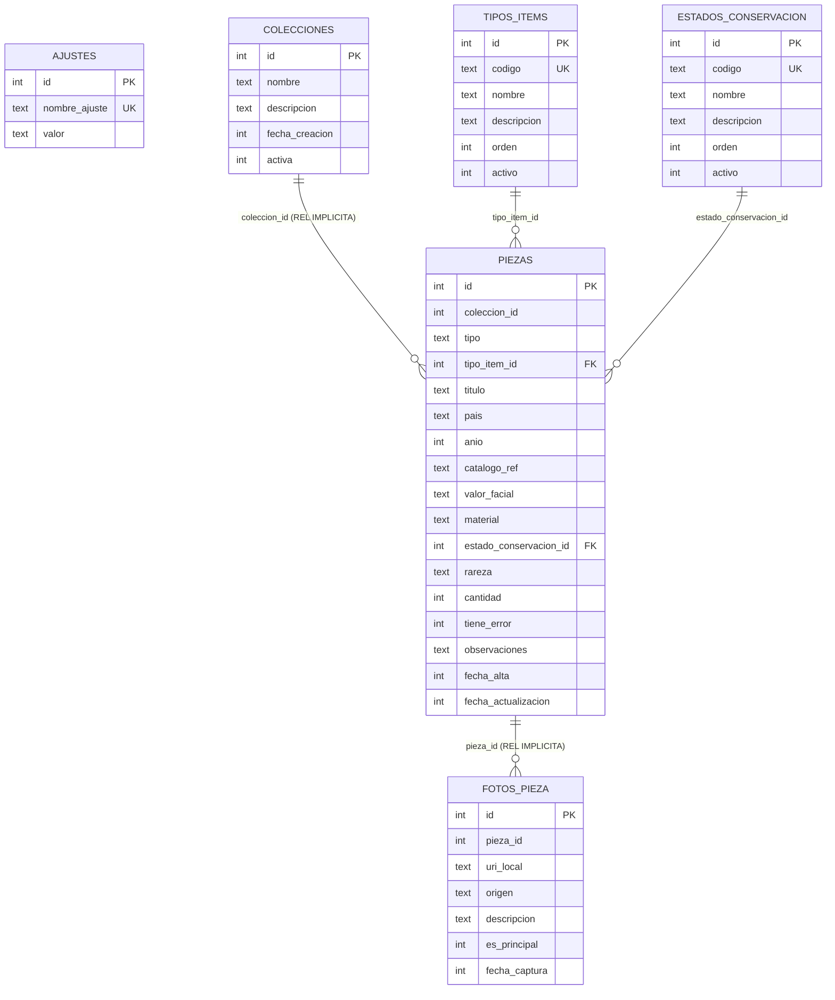

--- 
titlepage: true 
titlepage-logo: "images/cesar-Manrique.png" 
logo-width: 10cm 

title: "Módulo de Proyecto (PPP)"
subtitle: "Gestor de colecciones numismáticas " 
subsubtitle: "C.F.G.S. Desarrollo de Aplicaciones Multiplataforma (DAM)" 
author: [José Daniel Artiles González, Santiago Atienza Ferro, María Colina Lorda] 
keywords: [React, Expo, Drizzle, PPP, DAM ] 
date: '\today' 

lang: es 
toc: true 
toc-depth: 2

numbersections: true 

fontsize: 11pt
geometry: margin=2.5cm
highlight-style: tango
header-includes:
    - \usepackage{calc}
    - \newcounter{none}
    - \usepackage{lscape}
---
\newpage

# Modelo Entidad-Relacion (ER)

## Objetivo
Documentar el modelo de datos actual de la aplicacion con Mermaid, alineado con el esquema definido en Drizzle.

## Leyenda
- `PK`: clave primaria.
- `FK`: clave foranea.
- `UK`: restriccion unique.
- `REL IMPLICITA`: relacion usada por dominio pero sin `references()` explicita en el esquema.

## Diagrama ER (Mermaid)

## Notas de modelado
1. Las relaciones `PIEZAS.tipo_item_id -> TIPOS_ITEMS.id` y `PIEZAS.estado_conservacion_id -> ESTADOS_CONSERVACION.id` si estan declaradas con `references()` en el esquema Drizzle.
2. Las relaciones `PIEZAS.coleccion_id -> COLECCIONES.id` y `FOTOS_PIEZA.pieza_id -> PIEZAS.id` se modelan como relaciones implicitas de dominio, porque actualmente no tienen `references()` explicita en `schema.ts`.
3. `AJUSTES` no participa en relaciones directas con otras entidades del dominio de catalogacion.
