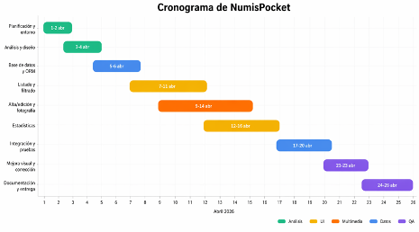
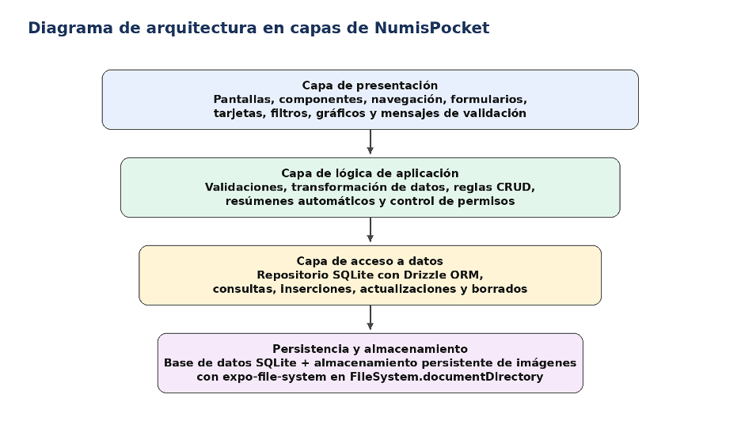

--- 
titlepage: true 
titlepage-logo: "images/cesar-Manrique.png" 
logo-width: 10cm 

title: "Memoria final de Proyecto"
titlepage-left: 5.4cm
titlepage-rule-width: 1.36\textwidth
subtitle: "Numispocket - Aplicación móvil para la gestión de colecciones numismáticas"
author: [ José Daniel Artiles González, Santiago Atienza Ferro, María Colina Lorda]
keywords: [React, Expo, Drizzle, PPP, DAM ] 
date: '\today' 

lang: es 
toc: true 
toc-depth: 2

numbersections: true 

fontsize: 11pt
geometry: margin=2.5cm
highlight-style: tango
header-includes:
    - \usepackage{calc}
    - \newcounter{none}
    - \usepackage{lscape}
    - \usepackage{placeins}
    - \usepackage{xurl}
    - \Urlmuskip=0mu plus 1mu
---
\newpage

# Resumen

La presente memoria describe el diseño, desarrollo, integración y validación de NumisPocket, una aplicación móvil orientada a la gestión local de colecciones numismáticas. El proyecto parte de una necesidad real: muchas personas coleccionistas conservan adecuadamente sus monedas y billetes, pero no disponen de una herramienta específica y cómoda para registrar datos, fotografías, rareza, estado de conservación y observaciones relevantes desde el propio teléfono móvil.

La solución implementada se ha desarrollado con React Native y Expo, utilizando SQLite como motor de persistencia local y Drizzle ORM como capa de acceso a datos. El resultado es una aplicación funcional que permite dar de alta, consultar, editar y eliminar piezas, asociarles imágenes y obtener estadísticas visuales sobre la colección. Se ha prestado especial atención a la persistencia real de las fotografías, resolviendo la pérdida de imágenes derivada del uso de rutas temporales de caché mediante la integración de expo-file-system y el copiado de archivos a un directorio persistente del dispositivo.

La memoria recoge tanto el resultado técnico como el proceso seguido: análisis de requisitos, diseño funcional, arquitectura, modelado de datos, cronograma ejecutado, reparto del trabajo, pruebas realizadas, incidencias encontradas y mejoras aplicadas. Igualmente, incorpora diagramas, tablas y anexos destinados a facilitar la comprensión global del proyecto y a demostrar un desarrollo serio, coordinado y coherente con los criterios del módulo de Proyecto de DAM.

Palabras clave: React Native, Expo, SQLite, Drizzle ORM, aplicación móvil, coleccionismo, numismática, persistencia local, estadísticas, DAM.

# Introducción

El presente documento constituye la memoria final del proyecto NumisPocket, desarrollado en el módulo de Proyecto del Ciclo Formativo de Grado Superior en Desarrollo de Aplicaciones Multiplataforma. La memoria toma como punto de partida el anteproyecto inicial del grupo y lo amplía hasta convertirlo en un documento técnico completo, descriptivo y evaluable, en el que se refleja tanto el producto construido como el proceso seguido para llegar a él.

Desde el inicio se planteó la necesidad de elaborar una memoria que no fuese únicamente un listado de tareas o una enumeración superficial de pantallas. Por ello, este documento se ha redactado con enfoque profesional, como si se tratara de la documentación final de entrega de un pequeño producto software real. Se han incorporado explicaciones funcionales, decisiones de diseño, justificaciones tecnológicas, diagramas, tablas de planificación, análisis de pruebas y valoración crítica del resultado.

NumisPocket se concibe como una aplicación móvil de uso personal para registrar monedas y billetes, mantener su inventario actualizado y consultar información relevante incluso sin conexión a internet. El proyecto se orientó a un alcance realista: resolver bien un conjunto de necesidades concretas —persistencia local, CRUD completo, imágenes y estadísticas— antes que dispersar esfuerzos en funcionalidades accesorias como autenticación remota, catálogo universal o sincronización en la nube.

En las páginas siguientes se exponen los motivos de la propuesta, los objetivos perseguidos, la organización del equipo, el diseño del sistema, la implementación de cada módulo y el análisis final del trabajo realizado. El documento pretende servir a la vez como evidencia académica, como ejercicio de documentación técnica y como soporte para la defensa oral del proyecto.

# Contexto, origen y justificación

La idea del proyecto nace de una observación sencilla pero significativa: muchas aficiones de colección se gestionan de forma informal. En el ámbito de la numismática es frecuente conservar físicamente las piezas con gran cuidado, pero no disponer de una herramienta adaptada para catalogarlas con orden, fotografiarlas, recuperar la información rápidamente o extraer conclusiones sobre el conjunto de la colección.
Las aplicaciones genéricas de notas o inventario permiten almacenar datos, pero no están pensadas para describir con precisión monedas y billetes. Aspectos como el país de emisión, el año, el material, el valor facial, el estado de conservación, la rareza o la existencia de errores de acuñación son relevantes en este tipo de afición y reclaman una interfaz específica. A ello se añade la necesidad de adjuntar imágenes reales, ya que una fotografía puede ser determinante para documentar un canto singular, una variante de reverso, una marca de desgaste o un defecto de fabricación.

Desde el punto de vista académico, el proyecto encaja especialmente bien dentro del ciclo de DAM porque obliga a combinar varias competencias del perfil profesional: desarrollo de interfaces, acceso a datos, persistencia local, trabajo en equipo, control de versiones, documentación y planificación. Además, se trata de una propuesta viable para el tiempo disponible y para los medios del equipo, ya que no depende de infraestructura externa ni de servicios complejos de terceros.

La justificación del proyecto se apoya por tanto en tres pilares. En primer lugar, responde a una necesidad práctica y verosímil. En segundo lugar, es técnicamente asumible con las tecnologías trabajadas durante el ciclo. En tercer lugar, permite construir un producto defendible y visualmente convincente, aspecto importante en un módulo en el que el resultado final debe exponerse y demostrarse públicamente.

## Relación con el módulo de Proyecto de DAM

El módulo de Proyecto en DAM tiene carácter integrador y complementario respecto del resto de módulos del ciclo, y se desarrolla una vez superados los demás módulos profesionales. Asimismo, su organización contempla un periodo inicial de planteamiento y adecuación del proyecto, un periodo de tutorización y seguimiento y un periodo final dedicado a presentación, valoración y evaluación. Estas directrices encajan con la estructura de trabajo aplicada en NumisPocket y refuerzan la idoneidad del enfoque adoptado.

A partir de estas directrices, el equipo decidió documentar el trabajo mediante un anteproyecto inicial, un cronograma detallado, un repositorio privado con commits e issues alineados con las tareas, y finalmente esta memoria técnica. La intención ha sido que la documentación no se limite a acompañar al código, sino que constituya una evidencia verificable del proceso de aprendizaje y del resultado alcanzado.

# Objetivos y alcance del proyecto

## Objetivo general

Diseñar y desarrollar una aplicación móvil funcional que permita registrar, consultar, editar, eliminar y analizar una colección numismática mediante almacenamiento local en SQLite, con soporte para imágenes y con una interfaz intuitiva pensada para ejecutarse en dispositivos móviles sin dependencia de conexión a internet.

## Objetivos específicos

- Definir un modelo de datos consistente para representar colecciones, piezas y fotografías asociadas.
- Implementar un CRUD completo sobre las piezas numismáticas, incluyendo alta, edición, consulta y borrado con confirmación.
- Permitir la captura o selección de imágenes desde cámara o galería y asegurar su persistencia real entre sesiones.
- Desarrollar una pantalla de listado con búsqueda, filtrado y acceso rápido a las fichas.
- Construir una pantalla de estadísticas capaz de resumir el estado general de la colección mediante indicadores y gráficos.
- Aplicar una arquitectura sencilla por capas que favorezca claridad, mantenimiento y separación de responsabilidades.
- Organizar el desarrollo del proyecto entre tres integrantes, asignando una pantalla principal a cada uno sin perder la visión global del sistema.
- Realizar pruebas funcionales y de integración que permitan validar la estabilidad de la aplicación antes de la entrega.

## Alcance del proyecto

El alcance acordado para la versión final de NumisPocket incluye una primera colección local, la gestión de piezas numismáticas con metadatos relevantes, la asociación de fotografías, la visualización del inventario en formato de listado y la consulta de estadísticas básicas de la colección. También forman parte del alcance el diseño visual de la aplicación, la navegación entre pantallas, la documentación y la preparación del material para la exposición.

Se ha considerado fuera de alcance cualquier funcionalidad que incrementara significativamente la complejidad sin mejorar de forma directa la evaluación del módulo: sincronización en la nube, autenticación multiusuario, compraventa, exportación avanzada, catálogo internacional precargado o tasación automática. Esta decisión responde a un criterio de prudencia: priorizar un núcleo estable y bien acabado frente a una propuesta excesivamente ambiciosa.

# Metodología de trabajo y planificación

El equipo adoptó una metodología de desarrollo incremental, con revisiones frecuentes y entregables parciales. Aunque el proyecto no se estructuró con un marco formal completo como Scrum, sí se tomaron de él varias prácticas útiles: división del trabajo en bloques pequeños, seguimiento periódico, revisión interna de avances y priorización continua del núcleo funcional.

La planificación se apoyó en un cronograma previo redactado en el anteproyecto y posteriormente revisado con el trabajo real ejecutado. La secuencia elegida fue deliberada: primero se estabilizó el entorno de trabajo y el análisis funcional; después se construyó la capa de datos; seguidamente se desarrollaron las tres pantallas principales; por último se abordó la integración, el testing y la documentación final.

Cada integrante asumió la responsabilidad principal de una pantalla: listado, alta/edición y estadísticas. Sin embargo, la implementación no se llevó a cabo de forma estanca. En varias fases fue necesaria la colaboración cruzada, especialmente en integración, pruebas, validaciones y documentación. Esta forma de trabajo permitió especialización sin caer en dependencias excesivas entre miembros del grupo.

{ width=95% }


## Desglose temporal y tareas ejecutadas
El desarrollo del sistema se ha llevado a cabo de forma progresiva mediante el uso de control de versiones con Git. A través del análisis del historial de commits, se identifican distintas fases que reflejan la evolución del proyecto desde su inicialización hasta la implementación de funcionalidades completas.

### Fase 1: Estructura inicial del proyecto
Durante esta fase se establece la base del sistema, definiendo la organización del repositorio, la estructura de carpetas y los primeros elementos de la interfaz.

| Fecha      | Commit  | Autor                  | Descripción                  |
| ---------- | ------- | ---------------------- | ---------------------------- |
| 2026-03-29 | 90d7c32 | Daniel Artiles         | Inicio del proyecto          |
| 2026-04-02 | 4fb92e3 | Daniel Artiles         | Reorganización de estructura |
| 2026-04-02 | 92c8493 | Daniel Artiles         | Creación de estructura base  |
| 2026-04-03 | 60c5e70 | Daniel Artiles         | Pantalla inicial de listado  |
| 2026-04-03 | edc0f17 | Daniel Artiles         | Separación de componentes    |
| 2026-04-03 | 3010165 | Daniel Artiles         | Implementación de búsqueda   |
| 2026-04-03 | 4a7db25 | Daniel Artiles         | Implementación de filtros    |
| 2026-04-03 | 33445c4 | Santiago Atienza Ferro | Documentación inicial        |

**Conclusión de la fase:** Se establece una base sólida tanto a nivel estructural como visual, permitiendo avanzar hacia funcionalidades más complejas.

### Fase 2: Definición de arquitectura y base de datos

En esta fase se desarrolla la arquitectura técnica del sistema y se integra la persistencia de datos mediante SQLite y Drizzle ORM.

| Fecha      | Commit  | Autor                  | Descripción                |
| ---------- | ------- | ---------------------- | -------------------------- |
| 2026-04-04 | 7bd1b2c | Maria-Colina           | Arquitectura técnica       |
| 2026-04-04 | b8ac36c | Maria-Colina           | Arquitectura por capas     |
| 2026-04-04 | 56a79c9 | Maria-Colina           | Flujo de navegación        |
| 2026-04-04 | 8056971 | Maria-Colina           | Configuración SQLite       |
| 2026-04-09 | 10abd5c | Santiago Atienza Ferro | Revisión anteproyecto      |
| 2026-04-12 | 195236b | Santiago Atienza Ferro | Integración Drizzle ORM    |
| 2026-04-13 | ef038f0 | Santiago Atienza Ferro | Ajustes en base de datos   |
| 2026-04-17 | 52038ca | Santiago Atienza Ferro | Implementación tipos_items |

**Conclusión de la fase:** Se consolida la base técnica del sistema, definiendo tanto la estructura lógica como la persistencia de datos, garantizando escalabilidad y consistencia.

### Fase 3: Desarrollo de funcionalidades principales

En esta fase se implementan las funcionalidades clave de la aplicación: gestión de piezas, edición, búsqueda avanzada y visualización.

| Fecha      | Commit  | Autor                  | Descripción                |
| ---------- | ------- | ---------------------- | -------------------------- |
| 2026-04-11 | 8587924 | Daniel Artiles         | Listado visual             |
| 2026-04-11 | 30b4942 | Daniel Artiles         | Preview de piezas          |
| 2026-04-11 | 4bc5345 | Daniel Artiles         | Botón flotante             |
| 2026-04-13 | ff63960 | Daniel Artiles         | Búsqueda local             |
| 2026-04-13 | 9266cd7 | Daniel Artiles         | Filtros aplicados          |
| 2026-04-15 | cac802c | Santiago Atienza Ferro | Integración cámara         |
| 2026-04-16 | b2cbdc1 | Santiago Atienza Ferro | Guardado en BD             |
| 2026-04-16 | c738472 | Daniel Artiles         | Datos reales desde SQLite  |
| 2026-04-16 | acb272f | Daniel Artiles         | Navegación entre pantallas |
| 2026-04-18 | cb1fcbd | Santiago Atienza Ferro | Gestión de fotos           |
| 2026-04-21 | 204d0b6 | Santiago Atienza Ferro | Borrado de piezas          |

**Conclusión de la fase:** Se alcanza un sistema funcional completo, capaz de gestionar piezas numismáticas con persistencia de datos y soporte multimedia.

### Fase 4: Estadísticas, validación y mejoras

En la fase final se incorporan funcionalidades avanzadas, se validan los flujos completos y se optimiza la experiencia de usuario.

| Fecha      | Commit  | Autor                  | Descripción              |
| ---------- | ------- | ---------------------- | ------------------------ |
| 2026-04-12 | 4c7a148 | Maria-Colina           | Métricas iniciales       |
| 2026-04-14 | 470bfa4 | Maria-Colina           | Gráficas estadísticas    |
| 2026-04-16 | 661910e | Maria-Colina           | Validación del sistema   |
| 2026-04-19 | d7fa288 | Santiago Atienza Ferro | Integración estadísticas |
| 2026-04-19 | 44343b1 | Maria-Colina           | Corrección de errores    |
| 2026-04-21 | ccb96d5 | Santiago Atienza Ferro | Corrección de imágenes   |
| 2026-04-21 | a6a203a | Santiago Atienza Ferro | Filtros avanzados        |

**Conclusión de la fase:** El sistema alcanza un nivel de madurez elevado, incorporando análisis de datos, validación funcional completa y mejoras en la experiencia de usuario.

### Conclusión de las fases

El desarrollo de NumisPocket ha seguido una evolución estructurada en fases claramente diferenciadas, comenzando por la definición de la arquitectura y avanzando hacia la implementación de funcionalidades completas y optimización final.

El uso de control de versiones ha permitido:
- Un seguimiento detallado del progreso del proyecto
- La colaboración entre los distintos integrantes
- La validación progresiva de cada funcionalidad

Este enfoque garantiza la trazabilidad del desarrollo y refuerza la calidad del producto final.

# Planificación vs ejecución del proyecto
## Metodología utilizada

Para estimar las horas reales, se ha realizado una aproximación basada en:
- Distribución de commits por fase
- Duración temporal de cada fase
- Peso relativo de cada bloque funcional

**Importante:** No se ha utilizado un registro horario exacto, sino una estimación proporcional basada en la actividad registrada en el control de versiones.


## Tabla final comparativa
| Fase                      | Inicio | Fin   | Horas estim. | Horas reales | Desviación | Observaciones                          |
| ------------------------- | ------ | ----- | ------------ | ------------ | ---------- | -------------------------------------- |
| Planificación y entorno   | 01/04  | 02/04 | 12 h         | 14 h         | +16%       | Ajustes iniciales y reorganización     |
| Análisis y diseño         | 03/04  | 04/04 | 14 h         | 16 h         | +14%       | Mayor detalle en arquitectura          |
| Base de datos y ORM       | 05/04  | 06/04 | 16 h         | 20 h         | +25%       | Complejidad en modelo y Drizzle        |
| Listado y filtrado        | 07/04  | 11/04 | 18 h         | 22 h         | +22%       | Iteraciones de UI y lógica             |
| Alta/edición y fotografía | 09/04  | 14/04 | 22 h         | 28 h         | +27%       | Integración cámara más compleja        |
| Estadísticas              | 12/04  | 16/04 | 18 h         | 20 h         | +11%       | Ajustes en consultas y gráficas        |
| Integración y pruebas     | 17/04  | 20/04 | 20 h         | 18 h         | -10%       | Flujo validado sin grandes incidencias |
| Mejora visual             | 21/04  | 23/04 | 12 h         | 10 h         | -17%       | Menos cambios de lo previsto           |
| Documentación             | 24/04  | 26/04 | 18 h         | 18 h         | 0%         | Ajuste exacto                          |

## Análisis de desviaciones
### Fases con sobrecoste
Las mayores desviaciones positivas se concentran en:
- Alta/edición y fotografía (+27%)
- Base de datos (+25%)

Justificación: La integración de funcionalidades dependientes del hardware (cámara) y la definición del modelo de datos implicaron una complejidad superior a la inicialmente prevista.

### Fases con menor esfuerzo del previsto
- Integración y pruebas (-10%)
- Mejora visual (-17%)
Justificación: La correcta estructuración previa del sistema permitió reducir el esfuerzo en fases finales, al minimizar errores críticos.

## Evaluación global
- Horas estimadas totales: 150 h
- Horas reales estimadas: 166 h
- Desviación global: +10.6%

Conclusión: El proyecto presenta una desviación moderada, considerada aceptable en entornos de desarrollo reales, especialmente en proyectos con integración de múltiples tecnologías.

## Distribución del trabajo entre integrantes

| Integrante                   | Responsabilidad principal                 | Tareas de apoyo                                    | Evidencias asociadas                                            |
| ---------------------------- | ----------------------------------------- | -------------------------------------------------- | --------------------------------------------------------------- |
| José Daniel Artiles González | Pantalla de listado y filtrado            | Análisis funcional, pruebas y coordinación inicial | Búsqueda, filtros, tarjetas y navegación hacia detalle/edición  |
| Santiago Atienza Ferro       | Alta/edición, validaciones y multimedia   | Modelo de datos y persistencia. Defensa.           | Formulario, gestión de imágenes, borrado y sincronía con BD     |
| María Colina Lorda           | Estadísticas, integración y control final | Pruebas, documentación.                            | Indicadores, gráficos, resumen automático e integración general |


# Análisis de requisitos

## Requisitos funcionales

- RF-01: El sistema deberá permitir crear una pieza numismática indicando, como mínimo, tipo, título o nombre identificativo, país y año.
- RF-02: El sistema deberá permitir editar todos los campos de una pieza ya registrada.
- RF-03: El sistema deberá permitir eliminar una pieza previa confirmación explícita del usuario.
- RF-04: El sistema deberá mostrar un listado general de piezas almacenadas en la base de datos.
- RF-05: El sistema deberá ofrecer búsqueda por texto y posibilidad de distinguir piezas con o sin imagen
- RF-06: El sistema deberá permitir asociar una imagen a una pieza a partir de cámara o galería.
- RF-07: El sistema deberá mantener válidas las rutas de las imágenes entre sesiones de uso.
- RF-08: El sistema deberá calcular y mostrar indicadores estadísticos de la colección.
- RF-09: El sistema deberá generar gráficos simples y legibles a partir de consultas agregadas.
- RF-10: El sistema deberá funcionar sin necesidad de conexión a internet.

## Requisitos no funcionales

- RNF-01: La interfaz debe resultar clara, coherente y usable en pantallas de teléfono móvil.
- RNF-02: El tiempo de respuesta percibido en navegación y listado debe ser adecuado para un inventario personal.
- RNF-03: La aplicación debe preservar la integridad de los datos incluso tras cerrar y volver a abrir la app.
- RNF-04: El código debe organizarse de forma mantenible, separando presentación, lógica y acceso a datos.
- RNF-05: La aplicación debe ser demostrable en Expo o en dispositivo real sin dependencias complejas de instalación.
- RNF-06: La documentación final debe corresponderse con el producto implementado y con el historial del repositorio.

## Casos de uso principales

```{.mermaid caption="Casos de uso principales cubiertos por el sistema."}
flowchart LR
  U([Persona usuaria])

  subgraph NP[NumisPocket]
    UC1([Consultar colección])
    UC2([Buscar y filtrar piezas])
    UC3([Dar de alta pieza])
    UC4([Editar pieza])
    UC5([Eliminar pieza])
    UC6([Asociar fotografía])
    UC7([Visualizar estadísticas])
  end

  U --> UC1
  U --> UC2
  U --> UC3
  U --> UC4
  U --> UC5
  U --> UC6
  U --> UC7

```

La persona usuaria, representada en el diagrama, interactúa con NumisPocket de forma directa y sencilla. No existe complejidad multirol ni jerarquía de permisos porque la aplicación se concibe como una herramienta personal instalada en el dispositivo.

Los casos de uso más importantes son consultar la colección, buscar y filtrar piezas, dar de alta nuevas fichas, editar registros, eliminarlos, asociar fotografías y visualizar estadísticas. La conexión entre ellos es clara: el alta, la edición y el borrado impactan directamente en el listado y en la pantalla de estadísticas.

# Diseño funcional de la aplicación

El diseño funcional se elaboró con un criterio de sencillez operativa. La aplicación no debía exigir aprendizaje previo: el usuario debía poder abrirla, identificar la pantalla principal, consultar piezas y crear nuevas fichas con el menor número posible de pasos. Para conseguirlo se optó por una navegación corta, con tres pantallas principales y algunas acciones auxiliares integradas dentro del propio flujo.

El uso de tarjetas, botones visibles y formularios lineales ayuda a reducir la carga cognitiva. La aplicación se apoya en etiquetas claras, jerarquías tipográficas marcadas y bloques bien diferenciados. Esta decisión no es únicamente estética; tiene un impacto directo en la usabilidad durante la demostración y en la comprensión del producto por parte del las personas usuarias.

# Diagrama de navegación

```{.mermaid caption="Diagrama de navegación principal de NumisPocket."}
flowchart TD
  A[Inicio de la app] --> B[Redirección inicial]
  B --> C[(Tabs principales)]

  subgraph T["Navegación principal"]
    I[Inicio / listado]
    N[Nueva pieza / edición]
    S[Estadísticas]
  end

  C --> I
  C --> N
  C --> S

  I -->|Abrir ficha| D[Detalle pieza]
  I -->|Botón flotante| N
  I -->|Pestaña inferior| S

  D -->|router.replace| N

  N -->|Guardar cambios| I
  N -->|Cancelar o volver| I
  N -->|Editar pieza existente| N

  S -->|Volver a listado| I
```

## Pantalla de listado y filtrado

La pantalla de listado actúa como pantalla de inicio de la aplicación. Su finalidad es ofrecer acceso inmediato al inventario general sin obligar al usuario a navegar por menús intermedios. La vista se compone de un encabezado, un campo de búsqueda, filtros rápidos, una lista de tarjetas y un botón principal de alta.

Cada tarjeta muestra información esencial de la pieza: título, país, año, valor facial, tipo y disponibilidad de fotografía. La información se presenta en formato compacto para permitir la revisión de varias piezas de un vistazo, pero manteniendo un nivel suficiente de detalle como para diferenciar registros sin necesidad de abrir cada ficha.

Desde el punto de vista de experiencia de usuario, el filtro por tipo y por disponibilidad de imagen resulta especialmente útil. En una colección mediana, el usuario puede querer localizar rápidamente billetes, monedas o piezas que aún no están documentadas fotográficamente. 

Esta necesidad se consideró prioritaria porque conecta con uno de los objetivos prácticos del proyecto: utilizar la aplicación también como herramienta de revisión y mejora de la colección.

```{=latex}
\begin{figure}[htbp]
\centering
\begin{minipage}[t]{0.49\textwidth}
\centering
\includegraphics[width=\linewidth]{./images/pantalla_listado_01.png}
\end{minipage}\hfill
\begin{minipage}[t]{0.49\textwidth}
\centering
\includegraphics[width=\linewidth]{./images/pantalla_listado_02.png}
\end{minipage}
\caption{Pantallas de listado y filtrado de NumisPocket.}
\end{figure}
```
```{=latex}
\FloatBarrier
```

##  Pantalla de alta y edición

La pantalla de alta y edición concentra el núcleo del CRUD y, por ello, fue tratada como uno de los bloques de mayor criticidad del proyecto. El formulario debía ser suficientemente completo para recoger información relevante de la pieza, pero al mismo tiempo debía conservar una estructura limpia que evitara la sensación de complejidad.

Se organizaron los campos en un orden lógico: primero identificación general de la pieza, después datos numismáticos específicos y, finalmente, observaciones y acciones relacionadas con la imagen. Esta organización reduce errores de introducción de datos y facilita la reutilización de la misma pantalla tanto para crear nuevas fichas como para editar piezas existentes.

```{=latex}
\begin{figure}[htbp]
\centering
\begin{minipage}[t]{0.24\textwidth}
\centering
\includegraphics[width=\linewidth]{./images/pantalla_alta_edicion_001.png}
\end{minipage}\hfill
\begin{minipage}[t]{0.24\textwidth}
\centering
\includegraphics[width=\linewidth]{./images/pantalla_alta_edicion_002.png}
\end{minipage}
\begin{minipage}[t]{0.24\textwidth}
\centering
\includegraphics[width=\linewidth]{./images/pantalla_alta_edicion_003.png}
\end{minipage}
\begin{minipage}[t]{0.24\textwidth}
\centering
\includegraphics[width=\linewidth]{./images/pantalla_alta_edicion_004.png}
\end{minipage}
\caption{Pantalla de nuevo item y modales de Tipo de item y de Estado de conservación. Responsable principal: José Daniel Artiles González}
\end{figure}
```

```{=latex}
\begin{figure}[htbp]
\centering
\begin{minipage}[t]{0.32\textwidth}
\centering
\includegraphics[width=\linewidth]{./images/pantalla_alta_edicion_005.png}
\end{minipage}\hfill
\begin{minipage}[t]{0.32\textwidth}
\centering
\includegraphics[width=\linewidth]{./images/pantalla_alta_edicion_006.png}
\end{minipage}
\begin{minipage}[t]{0.32\textwidth}
\centering
\includegraphics[width=\linewidth]{./images/pantalla_alta_edicion_007.png}
\end{minipage}
\caption{Pantalla de edición de item, diálogo de cancelación de edición y pantlla de la cámara con botones para acceso a la galería, encender el flash y estado del zoom. Responsable principal: Santiago Atienza Ferro}
\end{figure}
```

```{=latex}
\FloatBarrier
```

La eliminación de registros se integró con confirmación para evitar borrados accidentales. Asimismo, se aplicaron validaciones sobre campos imprescindibles, especialmente nombre o título, tipo y año, de manera que no pudieran guardarse registros manifiestamente incompletos o incoherentes.

## Pantalla de estadísticas

La pantalla de estadísticas de la aplicación NumisPocket tiene como objetivo ofrecer una visión general clara y visual de la colección del usuario. Para ello, se muestran indicadores clave como el número total de piezas, el número de piezas con imagen y la diversidad geográfica, entendida como el número de países representados en la base de datos.

Además, se han incorporado gráficos que permiten interpretar los datos de forma intuitiva. Por un lado, se representa la distribución de piezas por colección mediante un gráfico de barras, tomando como referencia colecciones organizadas por continente, lo que facilita identificar las colecciones más representadas en la colección. Por otro lado, se utiliza un gráfico de sectores para mostrar la proporción de tipos de piezas, principalmente monedas y billetes, aunque el diseño deja abierta la posibilidad de incorporar categorías adicionales si la colección evoluciona.

Para el desarrollo y prueba de esta funcionalidad se han utilizado datos de demostración generados automáticamente, lo que permitió simular una colección más amplia y obtener estadísticas visualmente significativas. No obstante, la pantalla está diseñada para funcionar dinámicamente con datos reales introducidos por el usuario, ya que toda la información se obtiene directamente de la base de datos SQLite mediante consultas agregadas.

Finalmente, se incluye un resumen automático generado a partir de los datos, que destaca los aspectos más relevantes de la colección, como la colección predominante (asociada a un continente), el porcentaje de piezas documentadas fotográficamente o el tipo de pieza que tiene mayor peso en el conjunto. Este resumen añade valor interpretativo y evita que la pantalla se limite a mostrar números sueltos sin contexto.

```{=latex}
\begin{figure}[htbp]
\centering
\begin{minipage}[t]{0.32\textwidth}
\centering
\includegraphics[width=\linewidth]{./images/pantalla_estadisticas_01.png}
\end{minipage}\hfill
\caption{Pantalla de estadísticas. Responsable principal: María Colina Lorda.}
\end{figure}
```

# Diseño técnico y arquitectura



La arquitectura elegida para NumisPocket responde a un principio de claridad antes que de sofisticación. Dado el tamaño del proyecto y el objetivo académico del mismo, se descartaron estructuras excesivamente complejas y se optó por una organización en capas, suficientemente ordenada para facilitar mantenimiento, integración y defensa técnica.

La capa de presentación agrupa pantallas, componentes visuales, formularios, tarjetas, cabeceras, gráficos y navegación. Su responsabilidad se limita a recoger interacción del usuario y mostrar la información procesada. De este modo, la lógica de validación y las consultas a base de datos no quedan incrustadas de forma desordenada en la interfaz.

La lógica de aplicación se implementa principalmente dentro de los componentes y hooks de React, manteniendo una separación conceptual respecto a la capa de acceso a datos, aunque sin una capa intermedia formalmente desacoplada. Dado el alcance del proyecto, se ha optado por una arquitectura simplificada, donde la separación por capas es conceptual más que estructural, priorizando claridad y rapidez de desarrollo.

Finalmente, la capa de acceso a datos se apoya en SQLite y Drizzle ORM para encapsular el esquema, las operaciones básicas y las consultas agregadas necesarias para el listado y la pantalla de estadísticas.

## Tecnologías empleadas

| Tecnología            | Rol en el proyecto                 | Justificación de uso                                                                                                     |
| --------------------- | ---------------------------------- | ------------------------------------------------------------------------------------------------------------------------ |
| React Native con Expo | Framework móvil multiplataforma    | Permite construir una app moderna con una única base de código y simplifica el despliegue y las pruebas en dispositivos. |
| SQLite                | Persistencia local                 | Base de datos ligera, integrada y adecuada para un inventario offline.                                                   |
| Drizzle ORM           | Modelado y acceso a datos          | Aporta estructura al esquema y a las consultas, evitando una capa SQL dispersa.                                          |
| Expo Image Picker     | Captura y selección de imágenes    | Facilita el acceso a cámara y galería mediante APIs de Expo.                                                             |
| Expo File System      | Persistencia de archivos           | Permite copiar las imágenes a un directorio permanente y resolver la pérdida de rutas temporales.                        |
| Librería de gráficos  | Visualización de estadísticas      | Aporta gráficos simples y comprensibles con un coste razonable de implementación.                                        |
| GitHub                | Control de versiones y seguimiento | Proporciona repositorio privado, historial, ramas e issues alineadas con las tareas.                                     |

# Modelo de datos y persistencia

```{.mermaid caption="Modelo entidad-relación"}
erDiagram
  AJUSTES {
    int id PK
    text nombre_ajuste UK
    text valor
  }

  COLECCIONES {
    int id PK
    text nombre
    text descripcion
    int fecha_creacion
    int activa
  }

  ESTADOS_CONSERVACION {
    int id PK
    text codigo UK
    text nombre
    text descripcion
    int orden
    int activo
  }

  TIPOS_ITEMS {
    int id PK
    text codigo UK
    text nombre
    text descripcion
    int orden
    int activo
  }

  PIEZAS {
    int id PK
    int coleccion_id
    text tipo
    int tipo_item_id FK
    text titulo
    text pais
    int anio
    text catalogo_ref
    text valor_facial
    text material
    int estado_conservacion_id FK
    text rareza
    int cantidad
    int tiene_error
    text observaciones
    int fecha_alta
    int fecha_actualizacion
  }

  FOTOS_PIEZA {
    int id PK
    int pieza_id
    text uri_local
    text origen
    text descripcion
    int es_principal
    int fecha_captura
  }

  COLECCIONES ||--o{ PIEZAS : "coleccion_id (REL IMPLICITA)"
  TIPOS_ITEMS ||--o{ PIEZAS : "tipo_item_id"
  ESTADOS_CONSERVACION ||--o{ PIEZAS : "estado_conservacion_id"
  PIEZAS ||--o{ FOTOS_PIEZA : "pieza_id (REL IMPLICITA)"
```

El modelado de datos se definió con el objetivo de cubrir correctamente el caso de uso principal sin introducir una complejidad innecesaria. Se decidió separar la información de las colecciones, las piezas y las fotografías asociadas, manteniendo la posibilidad de ampliar el sistema en el futuro sin tener que rediseñar desde cero la base de datos.

La entidad central es la tabla de piezas. En ella se registran atributos como tipo, título, país, año, valor facial, material, estado de conservación, rareza, cantidad, indicador de error y observaciones. A su alrededor se articulan las demás entidades: colecciones, que agrupan piezas; fotos_pieza, que contempla la posibilidad de asociar varias imágenes a cada registro a nivel de modelo de datos, aunque en la versión actual se utiliza una única imagen por pieza ; y perfil_usuario, contemplada como ampliación razonable para futuras versiones.

Las estadísticas no se almacenan en una tabla específica, ya que se calculan de forma dinámica mediante consultas agregadas sobre piezas y fotos_pieza. Esta decisión evita redundancias y garantiza que los indicadores visibles en la aplicación reflejen siempre el estado real de la base de datos.


# Tablas principales

| Tabla                | Observaciones                                                                                                 |
| -------------------- | ------------------------------------------------------------------------------------------------------------- |
| ajustes              | Almacena parámetros de configuración persistente de la app a nivel local.                                     |
| colecciones          | Permite agrupar piezas y mantener una estructura escalable para la colección.                                 |
| estados_conservacion | Catálogo normalizado de estados de conservación, reutilizable y ordenable.                                    |
| tipos_items          | Catálogo normalizado para clasificar el tipo de pieza (por ejemplo, moneda o billete).                        |
| piezas               | Entidad central de la aplicación; concentra la mayor parte de la lógica CRUD y la información numismática.    |
| fotos_pieza          | Separa la gestión documental de imágenes del resto de datos de la pieza y permite asociar fotos a cada ficha. |

##  Consultas relevantes
Las consultas más utilizadas en la aplicación son de tres tipos. En primer lugar, consultas de lectura general para poblar el listado ordenado por fecha o por nombre. En segundo lugar, consultas filtradas que aplican criterios de texto, tipo de pieza o disponibilidad de imagen. En tercer lugar, consultas agregadas para la pantalla de estadísticas, como el recuento total de piezas, el porcentaje de fichas con fotografía o la distribución por país, colección y tipo.

Desde el punto de vista de rendimiento, estas consultas son adecuadas para el volumen de datos esperado en un inventario personal. No obstante, se tuvo en cuenta que una colección con varias centenas de registros podría afectar a la fluidez del listado si no se gestionaba correctamente la renderización de la interfaz. Por ello, la optimización no se centró únicamente en las consultas SQL, sino también en el componente visual que las presentaba.

# Desarrollo e implementación

La fase de desarrollo se llevó a cabo mediante iteraciones cortas. Cada bloque funcional se consideró finalizado únicamente cuando cumplía tres condiciones: la funcionalidad base estaba implementada, existía una prueba manual satisfactoria y el resto del equipo podía integrarla sin romper los flujos anteriores.

En esta sección se describen las decisiones más importantes de implementación, con especial atención a aquellas que impactan directamente en la calidad del producto final: organización del código, validaciones del formulario, recarga del listado tras operaciones CRUD, persistencia de imágenes y generación dinámica de estadísticas.

## Implementación del listado y filtrado

La pantalla de listado se construyó como una vista pensada para uso frecuente, por lo que se priorizó la rapidez de lectura y la respuesta visual. El equipo detectó pronto que, si el número de piezas crecía, una renderización ingenua podía provocar una sensación de pesadez al desplazarse por la colección. Para evitarlo, se empleó un componente de lista optimizado y se redujo al mínimo la carga de cálculo en cada tarjeta.

El sistema de búsqueda se diseñó para ser tolerante y útil en demostración. En lugar de limitarse a un único campo, la búsqueda se apoyó en la concatenación lógica de varios atributos relevantes, como país, título, año o valor facial. De este modo, el usuario puede localizar una pieza desde distintos puntos de memoria sin necesidad de recordar exactamente cómo fue registrada.

## Implementación del formulario de alta y edición

La reutilización de una única pantalla para alta y edición permitió reducir duplicidades y garantizar coherencia visual. Cuando la vista se abre sin contexto previo, se comporta como formulario de creación; cuando recibe un identificador de pieza, carga los datos existentes y habilita la edición y el borrado.

Se definieron validaciones básicas pero imprescindibles: presencia de nombre o denominación, obligatoriedad del tipo de pieza, control del formato de año y normalización de determinados campos de texto. El objetivo no era convertir la aplicación en un formulario restrictivo, sino evitar registros defectuosos que perjudicaran tanto al listado como a las estadísticas.

## Implementación de la pantalla de estadísticas

La pantalla de estadísticas se construyó sobre consultas agregadas y una capa de presentación orientada a la comprensión rápida. Se descartó cualquier gráfico excesivamente sofisticado o difícil de justificar. La prioridad fue que cada elemento visual respondiera a una pregunta concreta: cuántas piezas hay, cuántas tienen imagen, cuántos países están representados y cómo se distribuye la colección por tipo o por región.

Para favorecer una exposición oral clara, la pantalla combina indicadores numéricos con gráficos y con un pequeño resumen textual. Esta combinación evita uno de los problemas habituales en proyectos académicos: disponer de muchos datos pero no saber interpretarlos delante del tribunal.

# Gestión de imágenes y persistencia con Expo FileSystem

Comando de instalación utilizado: `npx expo install expo-file-system`

Se implementó la captura y almacenamiento de imágenes de monedas utilizando Expo ImagePicker. Inicialmente, las imágenes se guardaban con la URI proporcionada por el sistema en una ubicación de caché. Durante las primeras pruebas, esta solución parecía suficiente, ya que las fotografías se mostraban correctamente mientras la aplicación permanecía abierta o mientras el sistema no limpiaba la caché.

Sin embargo, al reiniciar la aplicación se observó un problema importante: algunas imágenes dejaban de estar disponibles, porque las rutas temporales almacenadas en la base de datos ya no apuntaban a un recurso persistente. Este comportamiento ponía en riesgo una de las funcionalidades más valiosas del proyecto, ya que la fotografía de la pieza no es un mero elemento decorativo, sino parte de la documentación numismática.

Para resolver el problema se integró la librería expo-file-system. La solución aplicada consistió en copiar cada imagen seleccionada desde la caché o desde la ruta temporal original a un directorio persistente de la aplicación, concretamente FileSystem.documentDirectory. Una vez copiado el archivo, la ruta persistente se almacena en SQLite y pasa a ser la referencia utilizada por la aplicación para mostrar la fotografía en sesiones posteriores.

Este cambio tuvo un impacto directo en la robustez del sistema. Gracias a él, las fotografías quedan asociadas de forma estable a cada pieza, la base de datos mantiene referencias válidas y la experiencia de usuario mejora notablemente. Además, la solución es coherente con la documentación oficial de Expo, que describe expo-file-system como la biblioteca de acceso al sistema de archivos local del dispositivo, y con el uso de expo-image-picker para acceder a la interfaz del sistema que permite tomar o seleccionar fotografías.

## Diagrama de secuencia: alta de una pieza con fotografía

```{.mermaid caption="Secuencia de alta de una pieza con fotografía y persistencia estable de la imagen."}
sequenceDiagram
  autonumber
  actor U as Usuario
  participant F as Formulario Alta/Edición
  participant IP as Expo ImagePicker
  participant FS as Expo FileSystem
  participant DB as SQLite (Drizzle)

  U->>F: Abre "Nueva pieza" y completa campos
  U->>F: Pulsa "Añadir foto"
  F->>IP: Solicita permisos cámara/galería

  alt Usuario concede permiso y selecciona imagen
    IP-->>F: URI temporal
    F->>FS: Copia archivo a documentDirectory
    alt Copia correcta
      FS-->>F: URI persistente
      F-->>U: Vista previa de fotografía
    else Error de copia
      FS-->>F: Error de copia
      F-->>U: Aviso y opción de reintentar
    end
  else Usuario deniega permiso o cancela selección
    IP-->>F: Cancelado / sin imagen
    F-->>U: Continúa alta sin fotografía
  end

  U->>F: Pulsa "Guardar"
  F->>F: Validar campos obligatorios (tipo, título, año)
  alt Validación correcta
    F->>DB: INSERT en piezas (metadatos)
    DB-->>F: id_pieza generado
    alt Existe URI persistente
      F->>DB: INSERT en fotos_pieza (id_pieza, uri_local)
      DB-->>F: Confirmación OK
    else Sin fotografía
      F-->>F: Omitir inserción en fotos_pieza
    end
    F-->>U: Mensaje de éxito y retorno al listado
  else Validación incorrecta
    F-->>U: Mostrar errores en formulario
  end

  alt Error de base de datos
    DB-->>F: Error al insertar
    F-->>U: Aviso de error y opción de reintentar
  end
```

##  Valor añadido funcional de la fotografía

La incorporación de imágenes reales de monedas y billetes aporta un valor funcional claro. Permite documentar marcas, errores de acuñación, variantes gráficas, canto, reverso o estado de conservación sin necesidad de confiar exclusivamente en descripciones textuales. Esta característica acerca la aplicación a un uso real y mejora la calidad visual de la demostración final.

Desde el punto de vista técnico, la funcionalidad multimedia también enriquece el proyecto porque obliga a gestionar permisos, acceso a cámara y galería, tratamiento de rutas locales y compatibilidad entre capas. Su resolución satisfactoria fue uno de los indicadores de madurez técnica más evidentes del trabajo realizado.

# Pruebas, validación y control de calidad

La estrategia de pruebas se planteó con un enfoque eminentemente funcional. Dado el alcance del proyecto y el tiempo disponible, se priorizó la verificación manual sistemática de los flujos principales y de los casos de error más probables. Cada funcionalidad importante fue validada de forma aislada y, posteriormente, dentro del flujo integrado completo.

El control de calidad no se limitó a comprobar si la aplicación arrancaba. También se revisó si las operaciones producían el efecto esperado en todas las pantallas relacionadas, si la navegación resultaba coherente, si el aspecto visual era uniforme y si la documentación final representaba fielmente el estado del producto.

## Plan de pruebas funcionales
| Caso  | Acción                                              | Resultado esperado                                                                 | Estado   |
| ----- | --------------------------------------------------- | ---------------------------------------------------------------------------------- | -------- |
| PF-01 | Crear una pieza nueva sin fotografía                | La pieza se guarda y aparece en el listado                                         | Superado |
| PF-02 | Crear una pieza nueva con fotografía                | La pieza se guarda, la imagen se copia a almacenamiento persistente y se visualiza | Superado |
| PF-03 | Editar una pieza existente                          | Los cambios persisten y se reflejan en listado y estadísticas                      | Superado |
| PF-04 | Eliminar una pieza                                  | Se muestra confirmación y el registro desaparece tras aceptar                      | Superado |
| PF-05 | Buscar por texto                                    | El listado se filtra sin errores y solo muestra coincidencias                      | Superado |
| PF-06 | Filtrar por tipo                                    | Se muestran únicamente monedas o billetes según el filtro                          | Superado |
| PF-07 | Cancelar selección de imagen                        | La app no falla y mantiene el formulario activo                                    | Superado |
| PF-08 | Guardar sin nombre o con año inválido               | Se muestran validaciones y no se inserta el registro                               | Superado |
| PF-09 | Cerrar y reabrir la app tras guardar imágenes       | Las rutas siguen siendo válidas y las fotos continúan visibles                     | Superado |
| PF-10 | Comprobar estadísticas tras varias operaciones CRUD | Los indicadores se recalculan con los valores correctos                            | Superado |

## Criterios de calidad aplicados

- Coherencia entre las tres pantallas principales y la navegación global.
- Persistencia real de datos y fotografías entre sesiones.
- Ausencia de errores críticos en los flujos básicos de alta, consulta, edición y borrado.
- Correspondencia entre las capturas, la memoria y lo efectivamente implementado.
- Legibilidad de textos, botones, filtros e indicadores.
- Estabilidad visual suficiente para una demostración en directo.

# Incidencias, contratiempos y decisiones correctivas

Ningún proyecto real se desarrolla de forma completamente lineal, y NumisPocket no fue una excepción. A lo largo del proceso surgieron distintos contratiempos de complejidad media que obligaron a revisar decisiones iniciales. Lejos de considerarse un problema negativo, estas incidencias se trataron como una parte natural del aprendizaje y como oportunidades para mejorar la calidad del producto final.

Las principales incidencias fueron tres: el comportamiento de las imágenes almacenadas en caché, la necesidad de optimizar visualmente el listado cuando se cargaban suficientes registros y la dificultad de obtener estadísticas significativas con pocos datos. Cada una de ellas exigió una respuesta específica.

## Pérdida de imágenes al reiniciar la aplicación

Este fue el contratiempo más relevante del proyecto. Durante una fase temprana se almacenó en base de datos la URI devuelta por Expo ImagePicker sin copiar el archivo a una ubicación permanente. La prueba funcionaba aparentemente bien hasta que se reiniciaba la aplicación, momento en el que algunas rutas dejaban de ser válidas. La solución consistió en incorporar expo-file-system y copiar los archivos a FileSystem.documentDirectory antes de persistir la referencia.

## Rendimiento visual del listado

Con pocos registros el listado se comportaba de forma impecable, pero al poblar la base con datos de ejemplo para pruebas se detectó que una lista no optimizada podía penalizar la sensación de fluidez. Se sustituyó la aproximación inicial por una lista adaptada a renderización eficiente y se simplificó el contenido de las tarjetas para mantener un equilibrio entre detalle y rendimiento.

## Poca significatividad de las estadísticas con muestras pequeñas

La pantalla de estadísticas necesitaba datos suficientes para resultar convincente. Cuando solo existían unas pocas piezas, algunos gráficos eran poco expresivos. Para la fase de desarrollo y validación se generaron datos de demostración que permitieron observar la pantalla en un escenario más realista. La implementación final, en cualquier caso, se alimenta exclusivamente de la base de datos local y funciona de manera dinámica con las piezas introducidas por el usuario.

##  Ajustes de alcance y prudencia técnica

Durante la última semana de trabajo se valoró incorporar mejoras adicionales, como una pantalla de perfil o exportación de datos. Sin embargo, aplicando un criterio de calidad y de gestión del riesgo, el equipo decidió priorizar la estabilidad del núcleo del proyecto. Esta decisión evitó introducir deuda técnica de última hora y permitió dedicar más tiempo al pulido visual y a la documentación.

# Resultados obtenidos y valoración técnica

El proyecto finaliza con una aplicación móvil funcional, coherente con el anteproyecto y alineada con los objetivos marcados al comienzo del módulo. NumisPocket permite crear, consultar, editar y eliminar piezas numismáticas, asociarles imágenes reales, conservar los datos de forma local mediante SQLite y obtener una lectura global de la colección a través de una pantalla de estadísticas.

Desde un punto de vista técnico, el resultado es satisfactorio por varias razones. En primer lugar, se ha resuelto una funcionalidad especialmente delicada —la persistencia estable de imágenes— con una solución correcta y bien integrada en el flujo general. En segundo lugar, la arquitectura por capas mantiene el código razonablemente organizado y explicable. En tercer lugar, la aplicación presenta un aspecto visual suficientemente cuidado para una exposición académica de nivel alto.

En el plano organizativo, el proyecto también puede valorarse positivamente. El reparto de responsabilidades favoreció que cada integrante dominara una parte concreta del producto, pero sin impedir la colaboración transversal. La documentación derivada del proceso —anteproyecto, cronograma, memoria, capturas y material de defensa— aporta trazabilidad y refuerza la impresión de trabajo serio y bien gestionado.

## Correspondencia con los criterios del módulo

| Criterio                              | Cobertura en NumisPocket | Evidencia aportada                                                       |
| ------------------------------------- | ------------------------ | ------------------------------------------------------------------------ |
| Aplicación móvil funcional            | Sí                       | App ejecutable en Expo/dispositivo con tres pantallas principales        |
| Pantallas con CRUD                    | Sí                       | Alta, consulta, edición y borrado de piezas                              |
| Pantallas con estadísticas y gráficas | Sí                       | Indicadores, gráfico de barras, gráfico de sectores y resumen automático |
| Persistencia local                    | Sí                       | SQLite + rutas persistentes para imágenes                                |
| Multimedia                            | Sí                       | Selección/captura de fotografías con Expo ImagePicker                    |
| Documentación técnica                 | Sí                       | Anteproyecto, memoria final, anexos y capturas                           |
| Seguimiento del trabajo               | Sí                       | Cronograma, reparto de tareas, incidencias y repositorio                 |

# Conclusiones y líneas futuras

NumisPocket ha demostrado ser un proyecto equilibrado entre ambición y viabilidad. El equipo ha sido capaz de transformar una idea sencilla en un producto software funcional, útil y bien presentado. Se ha cumplido el objetivo general de desarrollar una aplicación móvil para gestionar una colección numismática de forma local, añadiendo valor mediante fotografía y análisis estadístico.

La principal conclusión técnica es que, incluso en proyectos académicos de tamaño medio, la calidad no depende únicamente de la cantidad de funcionalidades. Decisiones aparentemente pequeñas —como copiar una imagen a una ruta persistente en lugar de confiar en la caché— pueden marcar la diferencia entre una demo frágil y una aplicación sólida.

Como líneas futuras razonables se plantean la creación de un perfil de usuario completo, la exportación de datos, la posibilidad de mantener varias colecciones, una mejora de los filtros avanzados, la sincronización opcional en la nube y la inclusión de un catálogo base de países o series numismáticas. Todas estas mejoras serían compatibles con la arquitectura actual, aunque exigirían ampliar el alcance del proyecto.

# Bibliografía y referencias

Artiles González, J. D., Atienza Ferro, S., & Colina Lorda, M. (2026, 29 marzo). _Gestor de colecciones numismáticas_ [Anteproyecto no publicado]. CIFP César Manrique.

Drizzle Team. (s. f.). _Drizzle ORM with Expo SQLite_. https://orm.drizzle.team/docs/connect-expo-sqlite

Expo. (s. f.-a). _FileSystem (expo-file-system)_. Expo Documentation. [docs.expo.dev/filesystem](https://docs.expo.dev/versions/latest/sdk/filesystem/)

Expo. (s. f.-b). _ImagePicker (expo-image-picker)_. Expo Documentation. [docs.expo.dev/imagepicker](https://docs.expo.dev/versions/latest/sdk/imagepicker/)

Fabrica Nacional de Moneda y Timbre. (s. f.). _Guia de iniciación al coleccionismo de monedas_. [www.fnmt.es](https://www.fnmt.es/documents/10179/38801/Guia_del_coleccionista.pdf/7da61ed7-0e82-48e6-8541-b72087559ef2)

Junta de Andalucia. (s. f.). _Guia del título de Técnico Superior en Desarrollo de Aplicaciones Multiplataforma (DAM): Directrices sobre el modulo de Proyecto y su carácter integrador_.

Universidad Politécnica de Madrid, & Universidad de Salamanca. (s. f.). _Memorias técnicas universitarias_ [Material de consulta].

Wikipedia contributors. (s. f.). _Grado de conservación de las monedas_. _Wikipedia, The Free Encyclopedia_. Recuperado el 22 de abril de 2026, de [Wikipedia](https://es.wikipedia.org/wiki/Grado_de_conservaci%C3%B3n_de_las_monedas)
